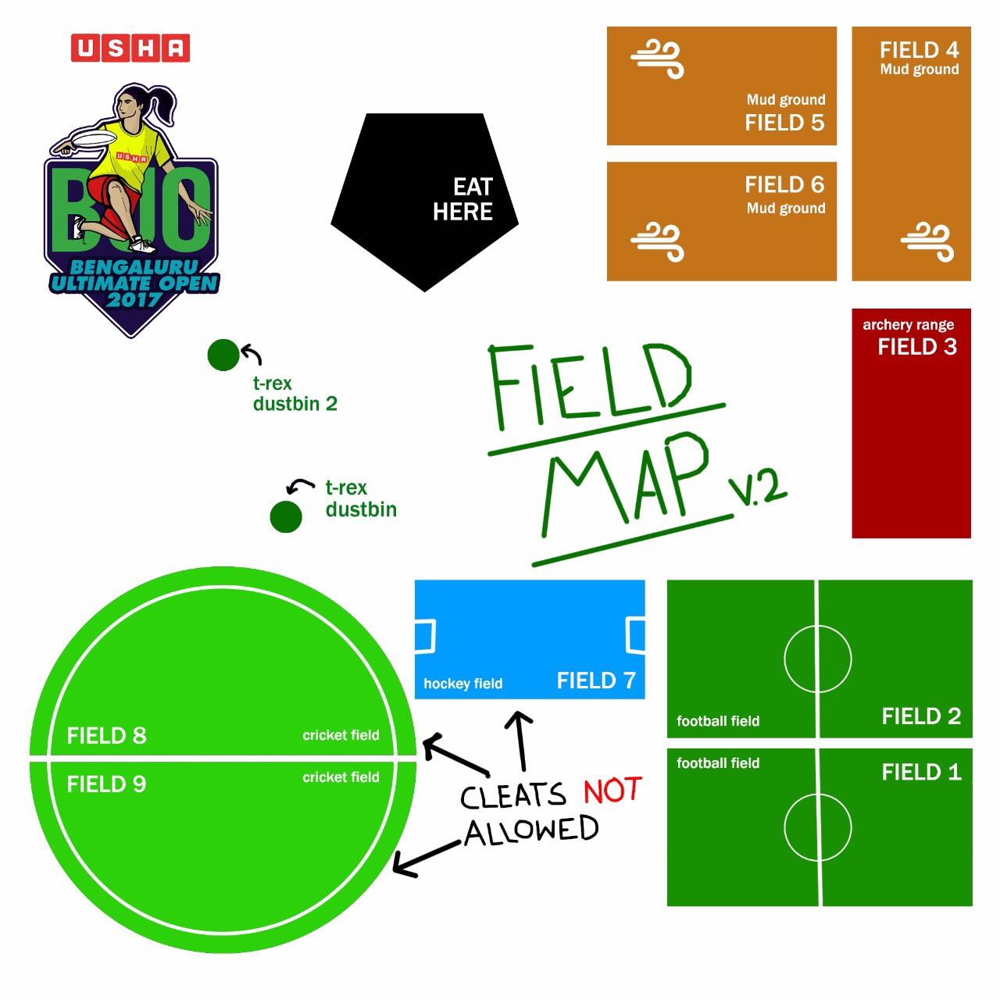

The Ultimate Player Association of India and Bangalore Ultimate present USHA BUO
2017!

The UPAI Tour is only beginning to get interesting, and Bangalore
welcomes all of India's competent Ultimate Frisbee teams to the annual
Bangalore Ultimate Open.

Tournament Format
=================

TBD

Rules
=====

- [WFDF 2017 Rules](https://rules.wfdf.org/) will be followed.

Spirit
======

- Spirit scoring will be done online
- XXX PlayO details
- Contact the tournament [spirit directors](#spirit-directors) in case of any further queries

Venue
=====

The venue for the tournament
is [Jain International Residential School](https://goo.gl/maps/LgG33cnJEZk).

Fields
------

- The venue has **9 fields** in all and below is the layout of the
  fields 

- Cleats are not allowed on Fields 1, 2 (Cricket field) & 3 (Hockey field). Play
  barefoot, in trainers or in regular shoes.

Venue restrictions
------------------

???

Food and Drink
--------------

- Jain International Residential School will provide all of us with some
  incredibly tasty food during the tournament.
- Breakfast is ₹80 (8 am to 9.30 am) and Lunch is ₹100. (1 pm to 2.30 pm) - a
  total of ₹180 per day, per player.
- You can either pay now or pay on the days you want to eat at the venue.
- Water will be available at the venue, but please BYOB (Bring your own
  bottles).
- Bananas ???
- Ice ???

Transport
---------

???

Fees
====

- Registration fees has already been received for players in the
  initial rosters of teams.

- In case of any changes in the rosters, teams should contact the
  TDs/Finance team to settle any differences in the amounts. The TDs
  leave it to the teams to do so in good faith.

Party!
======

- Keeping to Ultimate tradition, USHA BUO 2017 will have a party on Saturday
  evening at **Urban Woods** (close to Elim Resorts).
- We're having a Pyjama Party! All you fancy people can come dressed, obviously,
  but bonus points if you actually wear your PJs and turn up.
- There will be drinks and food but only those over 21 can chug those alcoholic
  liquids.
- Entry to the party will cost you guys ₹500 and it'll include food and the
  incredible time you're sure to have.
- There will also be a movie screening about the India U23 squad that went to
  London in 2015 - before the start of the party.
- Please approach the registration desk on day-1 of the tournament.

Sponsors
========

???

Contact information
===================

USHA BUO 2017 Organizing Leads
------------------------------

- Bharat Ashoka - **+91 97420 21082**
- Nithin Bharadwaj - **+91 99863 32303**

Spirit Directors
--------------------

- Sumedha Kandpal - **+91 97394 44862**
- Kiran Kumar C S - **+91 99008 66884**
- Benoy Stephen - **+91 99718 03431**

First Aid & Emergency
---------------------

- Varsha Yeshwant Kumar - **+91 99863 88290**

Transport
---------

- Nithin Bharadwaj - **+91 99863 32303**

Accommodation
-------------

- Yogesh B M - **+91 99861 52684**

Registration Desk
-----------------

- Khushwant Ramesh - **+91 88794 08326**
- Krishnan Nayar - **+91 99011 23120**

Food
----

- Kedar Sastry - **+91 99450 86566**
- Akilesh Mani - **+91 98863 60432**

Party
-----

- Adarsh Makam - **+91 99646 68578**
- Akilesh Mani - **+91 98863 60432**

Finance
-------

- Kiran Kumar C S - **+91 99008 66884**
- Sailesh Subramanian - **+91 72044 28090**
