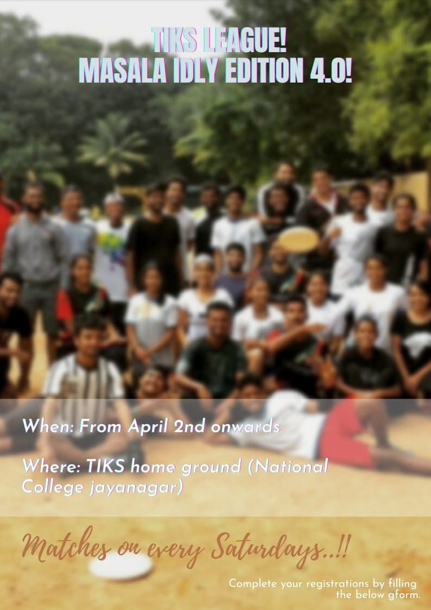

## Teams {#teams}

| Team 1           | Team 2       | Team 3          | Team 4          |
|------------------|--------------|-----------------|-----------------|
| **Aishu**        | **Ranjan**   | **Haritha**     | **Akilesh**     |
| **Appu**         | **Tez**      | **Pavan**       | **Prakruthi**   |
| Bugsy            | Advait       | Bharath (Poba)  | AFR             |
| Chaitra          | Aman Mehta   | Dhivya          | Amith           |
| Harsha M Krishna | Eddie        | KK              | Ananth SG       |
| Kedi             | Megha        | Kavi            | Arvind S        |
| Keerthana J      | Mohith       | Nandini         | Charmaine       |
| Netha            | Nikki        | Ppr             | Iris Rose John  |
| Nicolai          | Nimisha      | Punch           | Karthik K       |
| Nishil           | Prajwal M    | Rahul           | Kasi            |
| Pai              | Rakshith     | Ringo           | Kavya Singaraju |
| Pani             | Samhita Bhat | Sasi            | Keerthika       |
| Saqlain          | Sanjana      | Sid (Siddharth) | Salman          |
| Sweatha          | VK           | Sree            | Sheetal         |
| Vijay S          | Zen          | Tanushree P     | Shilpi          |

## FAQ

- _I just attended two sessions. Is it ok for me to join the league?_

Hell yeah! You must! The idea of this league is to give everyone a chance to
play some competitive Ultimate in an safe and familiar environment that will
help everyone learn and grow.

- _I will be out of town for next two weeks. Can I still play?_

Yes, we specifically ask for the availability of players to let teams plan
their line-ups and strategy accordingly. We understand that not everyone can be
available every weekend for the next couple of months, and teams will adjust
accordingly. In extreme cases, the league schedule can also be adjusted.

- _Can I also get one of my friend to join the league now?_

Yes, please do! It would be nice if they can join some sessions during the
week, but just coming for the league is fine too.

- _Can I come only for the league and not come on the weekdays?_

Yes, that's totally cool! But, eventually you may get so hooked to Ultimate
that you want to come back on weekdays too.

- _I'm not fit enough to play in a tournament. What do I do?_

Join the league! Hopefully, participating in the league will inspire you to
improve your fitness, along with getting a little help from your teammates and
friends.

- _I played ultimate long back and stopped playing. Can I come anyway?_

*HELL YEAH! JUSHT YOU COME BACK!*

## League Schedule {#league-schedule}

| Date | 6:05 -- 6:50 am | 6:55 - 7:40 am |
|------|-----------------|----------------|
| TBD  |                 |                |

The schedule is **tentative** and is subject to change, as the league
progresses.  Captains will be notified of any changes.

<!-- ## Scores and Points table {#scores-and-points-table} -->

<!-- | A                 |       |       | B                     | -->
<!-- |-------------------|-------|-------|-----------------------| -->
<!-- | **Hubba Hubba**   | **9** | 1     | GST                   | -->
<!-- | Discpickable Us 3 | 6     | **9** | **Force Four**        | -->
<!-- | GST               | 4     | **8** | **Force Four**        | -->
<!-- | Hubba Hubba       | 5     | **9** | **Discpickable Us 3** | -->
<!-- | Hubba Hubba       | 4     | **7** | **Force Four**        | -->
<!-- | GST               | 8     | 8     | Discpickable Us 3     | -->

## League format and Rules {#league-format-and-rules}

{}
